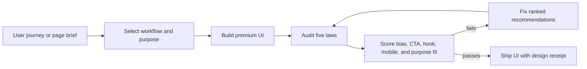

# The Digital Architect of Prestige 💎

A **coding-agent skill** for designing premium, high-conversion websites and
mobile UIs — for Claude Code, Codex, OpenCode, Cursor, and any agent that reads
a project skill file. It moves the agent beyond aesthetics into **applied
psychology and trust engineering**, and ships an **executable design linter** so
the agent can *verify* its output against the principles, not just intend them.

> Users judge credibility in ~50ms from visuals alone. If it looks
> professional, they assume the service is too (the Halo Effect). This skill
> engineers that halo — and refuses to let a pretty page ship over a broken one.

## Workflow at a glance



## Install into your agent (any OS)

```bash
python install.py                 # Windows / macOS / Linux (installs + verifies)
# then, inside your project:
prestige install claude           # or: codex · opencode · cursor · generic
```
That drops `SKILL.md` where your agent auto-reads it. From then on, any
"design a landing page / make this premium / build a checkout" request triggers
the skill.

## What the agent gets

**A design contract (`SKILL.md`)** encoding five laws it applies every time:

1. **The 50ms Halo** — hero section, one bold headline, high-fidelity cover imagery.
2. **Cognitive Fluency** — Hick's/Miller's Law, extreme whitespace, one goal per section, `line-height ≥ 1.6`.
3. **Trust Engineering** — security + social-proof cues at decision points, total price incl. fees upfront, guest checkout.
4. **Peak-End Rule** — micro-interactions at the peaks, inline form validation, a rewarding confirmation ending.
5. **Horn-Effect Defense** — one Visual DNA in CSS variables, mobile-first stability, no dated cues.

**An executable linter (`prestige audit`)** that scores generated HTML/CSS on all
five laws and **hard-fails on major functional flaws** — because the skill's one
non-negotiable rule is *never let aesthetics mask a broken primary action or an
inaccessible UI.*

```bash
prestige scaffold site.html        # premium starter (scores 100/100)
prestige brief PRD.md --purpose developer # opinionated design brief before UI work
prestige audit site.html           # score the five laws + catch Horn-Effect triggers
prestige purpose site.html --purpose developer  # opinionated purpose-fit audit
prestige audit site.html --strict  # exit 1 if failing — use as an agent/CI gate
```

## Design brief compiler

Prestige now compiles an opinionated Visual DNA before implementation and
collects browser evidence after implementation:

```bash
prestige theme developer --out prestige.theme.json
prestige brief PRD.md --purpose developer --out DESIGN_BRIEF.md
prestige audit app.html --strict
prestige render-audit app.html --out-dir .prestige/render
prestige challenge app.html --purpose developer --workflow product
```

`theme` controls palette semantics, typography, density, spacing, geometry,
imagery, motion, trust placement, and purpose-specific anti-patterns.
`render-audit` captures desktop and mobile screenshots and blocks hidden pages,
horizontal overflow, incoherent region overlap, and missing visible actions.
`challenge` proves the instrument rejects hidden, mobile-broken, and
action-hollow mutants before its receipt can enter a Factory Passport.

`prestige brief` turns a PRD or page brief into an opinionated design contract:
the audience psychology, purpose-fit directives, anti-patterns, required
sections, and verification commands. Use it before generating UI so the agent
does not pick a generic landing-page style for a developer tool, healthcare
workflow, fintech surface, marketplace, SaaS dashboard, luxury brand, or
editorial page.

The brief is intentionally prescriptive. A developer tool should lead with
docs, commands, screenshots, GitHub/demo trust, and receipts. A healthcare
workflow should feel calm, consent-aware, private, and clinically restrained.

Example on a deliberately clunky page:
```
Overall: 18/100   Verdict: NEEDS WORK
halo:15  fluency:20  trust:20  peak:20  horn:15
⛔ HARD FAILURES (fix before shipping — function over aesthetics):
   MAJOR_FLAW: primary action button has no accessible label/text.
   ✗ [trust] T_NO_SECURITY: Transactional UI with no security cue near actions.
   ✗ [horn]  C_NO_VIEWPORT: Missing viewport meta — mobile layout will break.
```

## The workflow the skill teaches

`Discovery` (audit the journey for trust gaps) → `Build` (apply the five laws)
→ `Verify` (`prestige audit`, fix flags, then present). The agent treats a
failing audit like a failing test — which is exactly how "premium" stops being
a vibe and becomes a checkable property.

## The psychology, sourced
Halo Effect & the 50ms window · Aesthetic-Usability Effect · Hick's & Miller's
Law · Fitts's Law · Peak-End Rule · Negativity/Horn Effect. Detailed playbooks
in `references/` (hero-halo, cognitive-fluency, trust-engineering, peak-end).

## v0.2 — deeper psychology, stricter scoring, five workflows

- **Cognitive Bias Engine** — six research-backed biases (Von Restorff, Anchoring,
  Social Proof, Loss Aversion, Reciprocity, Cognitive Fluency) with detectors,
  quality scoring, and precise recommendations.
- **CTA & Hook Verification** — scores whether your call-to-action and headline
  are engineered to convert (weak-verb detection, reader-focus, power words,
  CTA-competition penalty) with exact rewrites.
- **Strict Mobile Judge** — thumb-reach tap targets, viewport discipline, real
  breakpoints, legible base text, sticky-CTA guidance — because trust breaks on
  mobile first.
- **Five Design-Principle Workflows** — Conversion Architect, Luxury Minimalist,
  Trust Engineer, Editorial Storyteller, Product-Led Pragmatist. Each is a
  distinct optimization strategy that re-weights the score.
- **Precision Scoring** — `prestige score <file> --workflow <key>` fuses laws +
  biases + CTA/hooks + mobile into a 0–100 conversion-readiness grade with
  **recommendations ranked by conversion impact**.

```bash
prestige workflows                          # see the five lenses
prestige score site.html --workflow trust   # precise score + ranked fixes
prestige score site.html --strict           # exit 1 if not conversion-ready
```

Grounded in established design research, the psychology profiles are design
hypotheses and lint rules, not measured
conversion lift. Product conversion claims require the project's own experiment
or analytics receipt.

## v0.3 - purpose-fit design judgment

Workflows answer **what the page optimizes for**. Purpose lenses answer **what
psychological job the design must do for this audience and domain**.

Prestige now ships deterministic purpose-fit profiles:

- `developer` - concrete proof, docs, CLI/API clarity, GitHub/demo trust.
- `healthcare` - calm reassurance, privacy, clinician proof, no miracle hype.
- `fintech` - security, transparent fees/rates, control, compliance cues.
- `luxury` - restraint, craft, whitespace, fewer louder elements.
- `marketplace` - bilateral buyer/seller trust, reviews, protection, comparison.
- `saas` - product visibility, integrations, ROI, low-friction activation.
- `editorial` - narrative rhythm, sources, evidence, satisfying end beat.

```bash
prestige purposes
prestige purpose site.html --purpose healthcare --strict
prestige score site.html --workflow trust --purpose healthcare
```

The purpose gate scores intent clarity, proof fit, visual theme fit, action
language, and purpose-specific anti-patterns. This makes Prestige more
opinionated in the right way: not just "pretty," but fit for the decision the
interface exists to change.

## License
Dual-licensed **Apache-2.0 OR MIT** — pick whichever your project prefers.
## Criterion attribution

Prestige 0.2.1 wraps its existing five per-law scores in the factory attribution
envelope. Run `prestige audit page.html --json` to receive one unit per design
criterion, its score and threshold, and the unchanged overall verdict.
[](https://github.com/zrk222/code-factory-4-design/actions/workflows/ci.yaml)
[](https://pypi.org/project/code-factory-4-design/)
